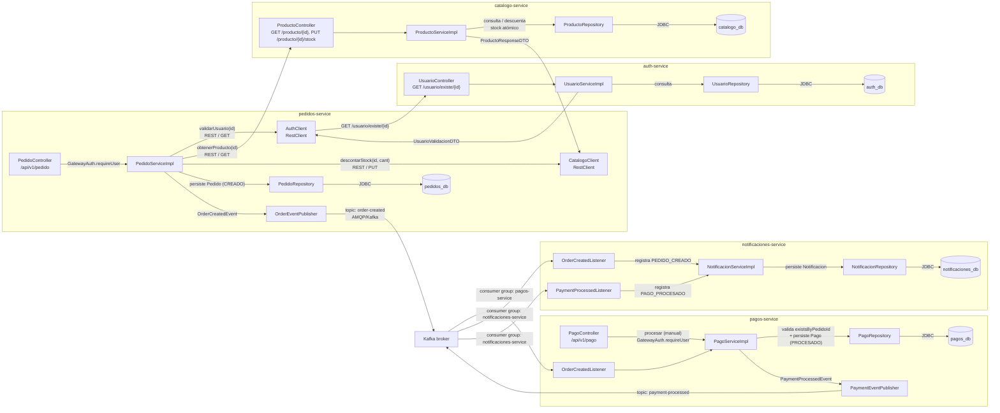

# C4 — Nivel 3: Diagrama de Componentes (flujo de pedido → pago → notificación)

Este diagrama detalla los componentes internos de los tres servicios implicados
en la cadena principal de negocio.

**Lectura del flujo:**
1. El cliente crea un pedido en `pedidos-service` (requiere header `X-User-Id`).
2. `pedidos-service` valida la existencia del usuario contra `auth-service`
   (`GET /usuario/existe/{id}`).
3. Por cada producto, consulta precio/stock a `catalogo-service` y **descunta el
   stock** (`PUT /producto/{id}/stock`) de forma atómica.
4. Con los productos validados, persiste el `Pedido` (estado `CREADO`) y publica
   `OrderCreatedEvent` en Kafka.
5. `pagos-service` consume `order-created` (o recibe pago manual por API), persiste
   el `Pago` (estado `PROCESADO`, idempotente por `UNIQUE pedido_id`) y publica
   `PaymentProcessedEvent`.
6. `notificaciones-service` consume ambos tópicos y registra las notificaciones
   `PEDIDO_CREADO` y `PAGO_PROCESADO`.

**Nota sobre estados:** el `Pedido` aún no se actualiza a `PAGADO` (ningún
consumidor de `payment-processed` existe en `pedidos`); ese ciclo de estados queda
pendiente de la `Fase 2`.
