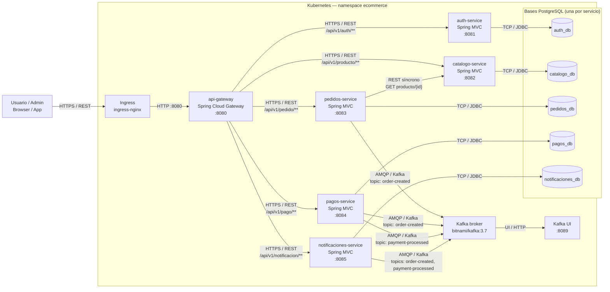

# C4 — Nivel 2: Diagrama de Contenedores

**Notas de estilo C4:**

| Elemento | Convención C4 | En el diagrama |
|---|---|---|
| Actor externo | persona | usuario/adminsitrador |
| Contenedor (proceso) | Microservicio | gateway + 5 servicios + broker |
| Base de datos | contenedor de datos | `DB_*` |
| Comunicación | protocolo sobre la flecha | HTTPS/REST, JDBC, Kafka |

**Observaciones de arquitectura:**
- Único punto de entrada externo: `Ingress → api-gateway` (ADR-0002, ADR-0005).
- `pedidos → catálogo` es la única llamada REST síncrona; el resto de la cadena
  aguas abajo es asíncrona por Kafka (ADR-0003).
- Persistencia aislada por dominio (ADR-0004).
