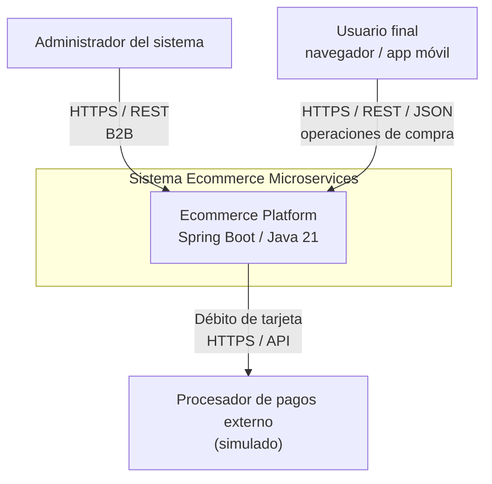

# C4 — Nivel 1: Diagrama de Contexto

**Lectura:** los actores externos (usuario final y administrador) interactúan con
la plataforma a través de HTTP. El procesador externo de pagos es una integración
simulada en esta etapa del proyecto.

**Notas:**
- Todo el tráfico entra por el `api-gateway` (ver Nivel 2).
- La plataforma se despliega en Kubernetes con un `Ingress` (ADR-0005).
